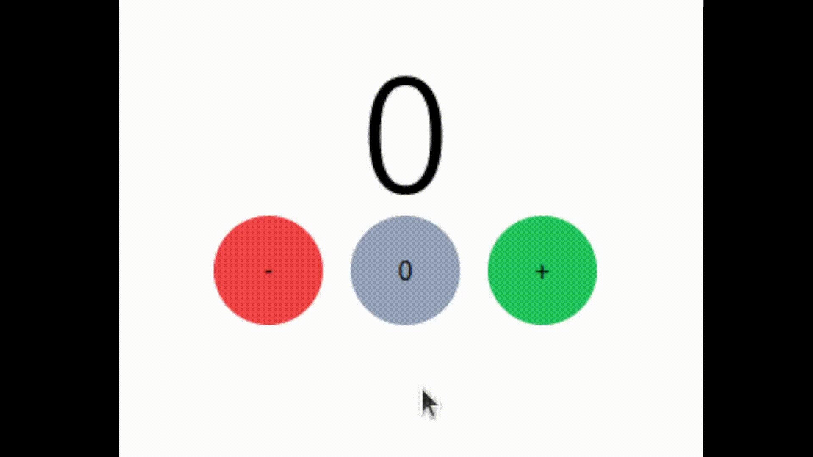

<!-- English Default Config -->
<h1 align="center">Counter</h1>
<h3 align="center">Increment and Decrement value</h3>
<h4 align="center">Deploy: <a href="https://flavio-nassim-bittar-filho.github.io/Counter/">https://flavio-nassim-bittar-filho.github.io/Counter/</a></h4>

&#xa0;

**
Summary
**

  <a href="#dart-about">About</a> &#xa0; | &#xa0;
  <a href="#white_check_mark-functionalities">Functionalities</a> &#xa0; | &#xa0;
  <a href="#computer-technologies">Technologies</a>

  <a href="#camera-images">Images</a> &#xa0; | &#xa0;
  <a href="#orange_book-how-to-use">How to use</a> &#xa0; | &#xa0;
  <a href="#scroll-prerequisites">Prerequisites</a> &#xa0; | &#xa0;
  <a href="#sparkles-author">Author</a>

&#xa0;

## :dart: About

The project was developed to understand how the contexts and states of a react.js component work

&#xa0;

## :white_check_mark: Functionalities

- [x] Show current value
- [x] Decrease value by 1
- [x] increase value by 1

&#xa0;

## :computer: Technologies

- React.js
  - useState - Hook
  - useCallBack -Hook
  - useContext
- TypeScript
  - Interface
- Tailwind

&#xa0;

## :camera: Images

  

&#xa0;

## :orange_book: How to use

the counter starts at 0 and as you click on the + or - buttons it increments or decrements the value by 1, the middle button serves to reset the counter

&#xa0;

## :scroll: Prerequisites

To use the system, all you need is a browser of your choice and an internet connection.

&#xa0;

## :sparkles: Author

  <h4>Made by Flávio Nassim Bittar Filho</h4>

  

&#xa0;

 

